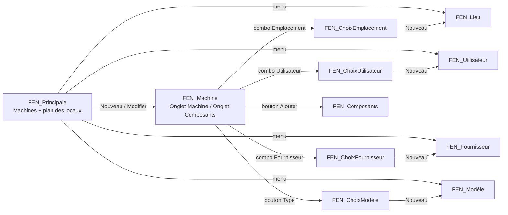

# Rétro-ingénierie des écrans — exemple WinDev « WD Gestion de parc informatique »

Document d'entrée pour la reconstruction des écrans avec le MCP Convertigo. Rien n'a encore été créé côté Convertigo : ce dossier décrit l'existant WinDev (modèle de données, 11 fenêtres, règles métier) et propose la correspondance NGX/Ionic ainsi que la spec `upsert-crud` à soumettre.

## 1. Source et méthode

| Élément | Détail |
|---|---|
| Dépôt | https://github.com/PCSOFT-WINDEV-code-source/WD-Gestion-de-Parc-informatique (organisation officielle PC SOFT, exemples livrés avec WINDEV) |
| Version | WinDev 28, projet en format texte (YAML), langue fr-FR |
| Contenu | 1 projet `.WDP`, 11 fenêtres `.wdw`, 6 états `.wde`, 4 requêtes `.WDR`, 1 collection de procédures `.wdg`, analyse HFSQL (`.ana`, `.xdd`), données de démo HFSQL Classic (`Exe/*.FIC`), plan des locaux `plan_locaux.gif` |
| Licence | Exemple didactique PC SOFT : modification et réutilisation réservées aux détenteurs d'une licence WINDEV 28 (voir `readme.md` du dépôt). La reconstruction Convertigo ne réutilise aucun code, seulement la description fonctionnelle. |
| Copie locale | `sources/WD-Gestion-de-Parc-informatique/` (clone git, profondeur 1) |
| Alternative clonée | `sources/WD-Gestion-Contacts/` (gestion de contacts, 5 fenêtres, plus simple) si l'on veut une démo plus courte |

Méthode d'extraction (scripts dans `analyse/`) :

- `parse_wdw.py` : parse les `.wdw` (YAML PC SOFT) → `wdw.json` (fenêtres, contrôles, positions, colonnes, événements et code WLangage).
- Les blocs `internal_properties` sont chiffrés/propriétaires : libellés, liaisons fichier, styles et contenus de combos n'y sont pas lisibles. Les libellés ci-dessous sont donc **déduits** de la charte de nommage (`SAI_NomMachine` → « Nom de la machine »), du code WLangage, des ressources de chaînes, des boîtes de dialogue et des états imprimés. Les liaisons fichier sont déduites des appels `FichierVersEcran`/`EcranVersFichier` et des noms de champs.
- Modèle de données lu dans l'export XML de l'analyse (`.xdd`).
- Données de démo décodées depuis les fichiers HFSQL Classic (`decode_fic.py` → `seed_data.json`) : 17 lieux, 50 utilisateurs, 15 fournisseurs, 229 modèles, 69 machines, 1 163 composants (dont 239 en stock, sans machine ni fournisseur). Format constaté : en-tête d'enregistrement de 8 octets + 1 octet de bitmap par tranche de 8 rubriques, textes et dates stockés taille + 1 (terminés par NUL), mémos = pointeur 8 octets, entiers little-endian.
- `wireframes.py` : maquettes filaires SVG générées à partir des coordonnées réelles des contrôles (`wireframes/*.svg`).

Légende des types de contrôle rencontrés (code `type` du format texte) : 2 = champ de saisie `SAI_`, 3 = libellé `LIB_`, 4 = bouton `BTN_`, 7 = liste `LISTE_`, 8 = image `IMG_`, 9 = table `TABLE_`, 14 = combo `COMBO_`, 16 = onglet `ONG_`, 27 = liste image `LSI_`. Événements : 18 = clic, 33 = sélection d'une ligne, 21 = affichage d'une ligne, 14 = initialisation (liste), 32 = choix d'option de menu, 34 = fin d'initialisation de la fenêtre (ouverture pour une fenêtre popup).

## 2. Vue d'ensemble fonctionnelle

Application de gestion de parc informatique : on gère des **machines** (poste, adresse IP), affectées à un **utilisateur** et situées dans un **lieu** (bureau dessiné sur un plan des locaux). Chaque machine est composée de **composants** matériels (UC, écran, mémoire, processeur…) décrits par un **modèle** (type, marque, jusqu'à 4 caractéristiques nommées) et achetés chez un **fournisseur**, avec suivi SAV (garantie, numéro et dates de retour/renvoi). Un composant sans machine est « en stock ».

Navigation :

Constantes projet : `CST_MODEVISUALISATION = 1`, `CST_MODECREATION = 2`, `CST_MODESUPPRESSION = 3` (mode d'ouverture des fenêtres de gestion), `CST_TypeUC = "Unité Centrale"` (type de modèle qui identifie l'unité centrale d'une machine).

## 3. Modèle de données (analyse HFSQL)

Types HFSQL : texte (taille max), date (AAAAMMJJ), mémo texte, mémo binaire (image), entier, identifiant automatique.

### UTILISATEUR
| Rubrique | Type | Clé | Rôle |
|---|---|---|---|
| Initiales | texte 10 | unique | identifiant fonctionnel (« Yves », « Martine »…), affiché dans les tables comme « Utilisateur » |
| Tel | texte 20 | | poste téléphonique (« Poste 86 ») |
| NomComplet | texte 30 | | « Yves O. » |
| Photo | mémo binaire | | photo ; par défaut `Images\visage_femme.gif` ou `visage_homme.gif` selon la civilité |
| Civilité | entier 2 octets | | index de la combo civilité ; 1 et 2 = femme, autre = homme (déduit du code), défaut 0 |

### LIEU
| Rubrique | Type | Clé | Rôle |
|---|---|---|---|
| IDLieu | id auto 4 | unique | |
| Emplacement | texte 40 | unique | nom du bureau (« Salle de réunion », « Atelier »…) |
| Commentaire | mémo texte | | |
| Rectangle | texte 19 | | coordonnées « x1,y1,x2,y2 » du bureau sur le plan (image 709×538) |
| Picto | mémo binaire | | pictogramme du lieu |

### MACHINE
| Rubrique | Type | Clé | Rôle |
|---|---|---|---|
| IDMachine | id auto 4 | unique | |
| NomMachine | texte 40 | unique | « MCH241 »… |
| InitialesUtilisateur | texte 10 | doublons | lien vers UTILISATEUR.Initiales (vide = machine disponible) |
| AdresseIP | texte 20 | doublons | « 94.0.1.1 » |
| IDLieu | entier 4 | doublons | lien vers LIEU.IDLieu (0 = pas de lieu) |

### FOURNISSEUR
| Rubrique | Type | Clé | Rôle |
|---|---|---|---|
| IDFournisseur | id auto 4 | unique | |
| NomFournisseur | texte 40 | unique | « COMPAQ », « DELL »… |
| Adresse | texte 300 | | adresse multi-ligne (souvent seulement la ville dans la démo) |
| Tel, TelSAV, Fax | texte 20 | | |
| clé composée | NomFournisseur + Adresse | | |

### MODELE
| Rubrique | Type | Clé | Rôle |
|---|---|---|---|
| IDMODELE | id auto 8 | unique | |
| TypeModele | texte 30 | doublons | « Unité Centrale », « Processeur », « Barrette de mémoire », « Carte SCSI »… |
| NomModele | texte 30 | doublons | « POWEREDGE 2100 », « PII 350 »… |
| MarqueModele | texte 30 | doublons | « DANE », « INTEL », « ADAPTEC »… |
| Caractéristique1..4 | texte 30 | doublons | **libellés** des caractéristiques (« Capacité (Mo) », « Vitesse (MHz) »…) |
| Valeur1..4 | texte 50 | | valeurs correspondantes (« 128 », « 350 »…) |
| Commentaire | mémo texte | | |
| clé composée | TypeModele + MarqueModele | | |

### COMPOSANT
| Rubrique | Type | Clé | Rôle |
|---|---|---|---|
| IDCOMPOSANT | id auto 8 | unique | |
| NSerie | texte 20 | | numéro de série (obligatoire) |
| DateAchat, DateRetour, DateRenvoi | date | | achat, retour SAV, renvoi SAV |
| Garantie | texte 20 | | « 2 ans », « 6 mois » |
| NumRetour | texte 20 | | numéro de retour SAV |
| Commentaire | mémo texte | | |
| NomMachine | texte 40 | doublons | lien vers MACHINE.NomMachine (vide = composant en stock) |
| IDMODELE | entier 8 | doublons | lien vers MODELE (obligatoire) |
| IDFournisseur | entier 4 | doublons | lien vers FOURNISSEUR |
| clé composée | NomMachine + IDMODELE | | |

Relations (implicites dans l'analyse, pas de contrainte d'intégrité déclarée) :

- MACHINE.IDLieu → LIEU.IDLieu (n-1, optionnel)
- MACHINE.InitialesUtilisateur → UTILISATEUR.Initiales (n-1 par clé naturelle, optionnel)
- COMPOSANT.NomMachine → MACHINE.NomMachine (n-1 par nom, optionnel ; le renommage d'une machine répercute le nom sur ses composants)
- COMPOSANT.IDMODELE → MODELE.IDMODELE (n-1, obligatoire)
- COMPOSANT.IDFournisseur → FOURNISSEUR.IDFournisseur (n-1)

Règles d'intégrité codées dans les fenêtres : un lieu, un utilisateur, un fournisseur ou un modèle ne peut pas être supprimé s'il est référencé (machines ou composants). La suppression d'une machine propose : supprimer aussi tous ses composants, ou supprimer seulement l'UC et remettre les autres composants en stock.

Proposition de modèle SQL pour Convertigo (identifiants techniques partout, liens par id) : voir `convertigo-crud-spec.json`. Correspondance : `utilisateurs`(id, initiales, tel, nom_complet, photo, civilite), `lieux`(id, emplacement, commentaire, rectangle, picto), `machines`(id, nom_machine, utilisateur_id, adresse_ip, lieu_id), `fournisseurs`(id, nom, adresse, tel, tel_sav, fax), `modeles`(id, type_modele, nom_modele, marque, caracteristique1..4, valeur1..4, commentaire), `composants`(id, n_serie, date_achat, garantie, num_retour, date_retour, date_renvoi, commentaire, machine_id, modele_id, fournisseur_id).

## 4. Fiches écran

Positions en pixels (x, y, largeur, hauteur) dans la zone cliente ; maquettes dans `wireframes/<fenêtre>.svg`. Sauf mention, les boutons font 96×24.

### 4.1 FEN_Principale — fenêtre principale « Gestion de Parc Informatique » (974×652)

Rôle : liste des machines filtrable par lieu en cliquant sur le plan des locaux ; point d'entrée vers toutes les autres fenêtres.

| Contrôle | Type | Position | Rôle |
|---|---|---|---|
| Menu `OPT_Menu` | menu | barre de menu | options : Modifier le plan des locaux → `FEN_Lieu` ; Gérer les utilisateurs → `FEN_Utilisateur` ; Gérer les fournisseurs → `FEN_Fournisseur` ; Gérer les modèles → `FEN_Modèle` |
| LIB_Gestion_de_Parc_Informatique | libellé titre | 12,14,453,30 | « Gestion de Parc Informatique » |
| BTN_Nouveau / BTN_Modifier / BTN_Supprimer / BTN_Imprimer | boutons | y=17, x=544/646/748/850 | barre d'actions |
| LIB_MachinesAffichées | libellé | 16,57,121,20 | « Machines affichées : » |
| LIB_Filtre | libellé | 143,57,599,20 | « Machines dans la salle %1 » quand un lieu est sélectionné |
| BTN_Toutes | bouton 204×24 | 748,55 | « Toutes les machines » : annule le filtre |
| TABLE_Machines | table remplie par code | 16,86,216,506 | colonnes : COL_Disponible (icône IMG_MachineDispo / IMG_MachineUtilisée), COL_Machine (NomMachine), COL_Utilisateur (InitialesUtilisateur), COL_IDMachine (masquée) |
| IMG_PlanLocaux | image cliquable | 247,86,709,506 | plan des locaux dessiné par `AffichePlan` : un rectangle par LIEU (coordonnées `Rectangle`), nom du lieu tronqué à 16 caractères, nombre de machines (« Vide », « 1 machine », « %1 machines ») ; résultat sauvé dans `plan_locaux.gif` |

Comportement :

- Ouverture : toast « Cliquez dans le plan pour afficher les machines d'une salle donnée. », dessin du plan, affichage de toutes les machines.
- Clic sur le plan : détermine le lieu (point dans rectangle), mémorise `gnIDLieu`, entoure le lieu en rouge, filtre la table sur ce lieu, met à jour LIB_Filtre.
- Sélection d'une ligne : redessine le plan et entoure en rouge le lieu de la machine sélectionnée.
- Nouveau : ouvre `FEN_Machine` sans paramètre (création) ; au retour, rafraîchit la table (filtre courant conservé) et sélectionne la machine créée.
- Modifier : ouvre `FEN_Machine(IDMachine)` ; au retour, rafraîchit et repositionne.
- Supprimer : boîte « Voulez-vous supprimer la machine '%1'.. » avec 3 choix : « Et tous ses composants ? » (supprime composants + machine), « Et son UC et mettre les autres composants dans le stock ? » (supprime le composant de type Unité Centrale, vide NomMachine des autres, supprime la machine), « Ne rien faire ».
- Imprimer : aperçu de l'état `Etat_Machine` (liste des machines : machine, emplacement, utilisateur, adresse IP, total).

### 4.2 FEN_Machine — fiche machine (787×574, 2 onglets)

Paramètre `gnIDMachine` (0 = création). Valeur de retour : nom de la machine créée / Vrai si modifiée.

Onglet 1 « Machine » (zone 12,63,760,463) :

| Contrôle | Type | Position | Liaison / rôle |
|---|---|---|---|
| BTN_Appliquer / BTN_Annuler | boutons | 23,18 / 125,18 | Appliquer : création (`HAjoute`) puis activation de l'onglet Composants, ou modification (`HModifie`, propagation du nouveau nom aux composants) ; Annuler : recharge la fiche |
| SAI_NomMachine | saisie | 17,52,268,24 | MACHINE.NomMachine (obligatoire, unique) |
| COMBO_Emplacement | combo popup | 17,82,270,30 | MACHINE.IDLieu ; ouvre `FEN_ChoixEmplacement` |
| COMBO_Utilisateur | combo popup | 17,116,270,30 | MACHINE.InitialesUtilisateur ; ouvre `FEN_ChoixUtilisateur` |
| SAI_AdresseIP | saisie | 17,150,268,24 | MACHINE.AdresseIP |
| LIB_Note | libellé d'aide | 26,338,709,48 | visible seulement en création : il faut créer la machine avant de saisir ses composants |

Onglet 2 « Composants » (grisé tant que la machine n'est pas créée) :

| Contrôle | Type | Position | Liaison / rôle |
|---|---|---|---|
| Groupe `GR_BtnGestionComposants` : BTN_Nouveau, BTN_Modifier, BTN_Supprimer, BTN_Ajouter, BTN_Dissocier, BTN_Imprimer | boutons | y=18, x=24/124/224/324/424/524 | visibles hors édition |
| Groupe `GR_BtnNouveauComposant` : BTN_ValiderComposant, BTN_AnnulerComposant | boutons | 24,18 / 124,18 | visibles en création/modification (superposés aux deux premiers boutons) |
| LISTE_Composants | liste | 17,66,124,360 | composants de la machine (requête intégrée paramétrée par `pNomMachine` ; valeur = IDCOMPOSANT, affichage = numéro de série) ; la sélection charge le composant et son modèle |
| SAI_NSerieComp | saisie | 158,82,268,24 | COMPOSANT.NSerie (obligatoire) |
| SAI_DateAchatComp | saisie date | 158,112,199,24 | COMPOSANT.DateAchat |
| COMBO_Fournisseur | combo popup | 158,138,270,30 | COMPOSANT.IDFournisseur ; ouvre `FEN_ChoixFournisseur` |
| SAI_GarantieComp | saisie | 158,172,199,24 | COMPOSANT.Garantie |
| SAI_NumRetourComp | saisie | 158,202,268,24 | COMPOSANT.NumRetour |
| SAI_DateRetourComp | saisie date | 158,232,199,24 | COMPOSANT.DateRetour |
| SAI_DateRenvoiComp | saisie date | 158,262,199,24 | COMPOSANT.DateRenvoi |
| SAI_CommentairesComp | saisie multi-ligne | 158,292,268,135 | COMPOSANT.Commentaire |
| LIB_InfosLieu | cadre « Modèle » | 442,82,305,345 | panneau de droite décrivant le type de composant |
| BTN_Type | bouton | 448,121 | visible en édition : ouvre `FEN_ChoixModèle`, associe le modèle (confirmation « Voulez-vous vraiment associer le composant en cours au type de composant '%1' ? ») |
| SAI_NomModeleComp / SAI_MarqueModeleComp | saisie (lecture) | 448,151 / 448,181 (291×24) | MODELE.NomModele / MODELE.MarqueModele |
| SAI_Caractéristique1..4Comp | saisie (lecture) | 448, y=211/241/271/301 (291×24) | MODELE.Valeur1..4 ; libellé dynamique = MODELE.CaractéristiqueN + « : » ; masqués si vides |

Groupes d'état : `GR_Composant` (tous les champs composant, remis à zéro), `GR_NouveauComposant` (champs saisissables, Actif/Grisé selon le mode).

Actions de l'onglet Composants :

- Nouveau : vide le composant, passe en mode édition (liste grisée, bouton Type visible).
- Valider : contrôle NSerie et modèle obligatoires (« Veuillez saisir au moins le numéro de série du composant. », « Veuillez sélectionner le type du composant en choisissant son modèle. ») ; ajoute (puis associe à la machine après confirmation « Voulez-vous vraiment ajouter le composant '%1' à la machine '%2' ? ») ou modifie ; retour au mode consultation.
- Annuler : retour au mode consultation, recharge le composant sélectionné.
- Modifier : passe en mode édition.
- Ajouter : ouvre `FEN_Composants` (choix d'un composant existant) et l'associe à la machine (même confirmation).
- Dissocier : confirmation « Voulez-vous vraiment dissocier le composant '%1' de la machine '%2' ? » puis NomMachine = "" (retour en stock) ; message « Pas de composant à dissocier. » si liste vide.
- Supprimer : confirmation « Voulez-vous vraiment supprimer définitivement le composant '%1' de la base ? » ; message « Pas de composant à supprimer. » si liste vide.
- Imprimer : boîte « Voulez-vous imprimer le détail des composants ... » → « pour la machine seulement ? » / « pour toutes les machines ? » / « Ne rien faire » ; état `Etat_Composant_Machine`.

### 4.3 FEN_Composants — choix d'un composant (788×585)

Fenêtre modale retournant IDCOMPOSANT (0 si annulation). Titre « Composants ».

| Contrôle | Type | Position | Rôle |
|---|---|---|---|
| BTN_Valider / BTN_Annuler | boutons | 572,15 / 674,15 | Valider retourne `TABLE_Composants.COL_IDCOMPOSANT` |
| TABLE_Composants | table sur fichier/requête | 12,58,760,481 | colonnes : IDCOMPOSANT (masquée), Type, Marque, Modèle (depuis MODELE), NSerie, Utilisateur (calculée à l'affichage de la ligne : initiales de l'utilisateur de la machine), NomMachine, NomFournisseur, DateAchat, IDMODELE (masquée) |

Remarque : la source de la table (tous les composants ou seulement le stock) est dans les propriétés chiffrées ; la présence des colonnes NomMachine et Utilisateur indique que tous les composants sont listés avec leur affectation courante. Pour Convertigo, on recommande de ne proposer que les composants en stock (machine_id NULL).

### 4.4 FEN_ChoixModèle — choix d'un modèle de composant (788×608)

Fenêtre modale retournant IDMODELE (0 si annulation). Titre « Modèles de Composant ».

| Contrôle | Type | Position | Rôle |
|---|---|---|---|
| BTN_Valider / BTN_Annuler / BTN_Nouveau | boutons | 468,15 / 570,15 / 672,15 | Nouveau : ouvre `FEN_Modèle` en mode création puis sélectionne le modèle créé |
| TABLE_Modèles | table sur MODELE | 12,55,760,398 | colonnes : TypeModele, NomModele, MarqueModele, Commentaire, IDMODELE (masquée) ; la sélection charge la fiche |
| LIB_Libellé1 | cadre aperçu | 12,469,760,101 | zone « caractéristiques » |
| SAI_Caractéristique1..4 | saisie (lecture) | 24,512 / 24,542 / 475,512 / 475,542 (277×24) | MODELE.Valeur1..4 avec libellé dynamique MODELE.CaractéristiqueN ; masqués si vides |

### 4.5 FEN_ChoixEmplacement — popup de la combo Emplacement (657×472)

Fenêtre popup liée à `COMBO_Emplacement` (`MonChampPopup`). Titre « Lieux ». `LSI_Lieu` (11,57,633,405) : liste image des lieux (pictogramme + emplacement, valeur = IDLieu). BTN_Valider (348,15) affecte la sélection à la combo et ferme (idem double-clic), BTN_Annuler (450,15), BTN_Nouveau (552,15) ouvre `FEN_Lieu` en création puis sélectionne le lieu créé.

### 4.6 FEN_ChoixUtilisateur — popup de la combo Utilisateur (711×472)

Même structure que 4.5 avec `LSI_Utilisateur` (12,57,687,403) : liste image des utilisateurs (photo + initiales, valeur = Initiales). Nouveau → `FEN_Utilisateur` en création.

### 4.7 FEN_ChoixFournisseur — popup de la combo Fournisseur (657×406)

Même structure avec `TABLE_Fournisseurs` (12,57,631,339), colonnes IDFournisseur (masquée), NomFournisseur, Adresse, Tel, TelSAV, Fax ; retourne COL_IDFournisseur. Nouveau → `FEN_Fournisseur` en création, puis recherche du fournisseur créé par son nom.

### 4.8 FEN_Lieu — gestion des lieux sur le plan (974×634)

Paramètre `gnMode` (visualisation par défaut ; création depuis la popup). Retour : IDLieu créé (0 sinon). Titre « Gestion des lieux ».

| Contrôle | Type | Position | Liaison / rôle |
|---|---|---|---|
| BTN_Nouveau / BTN_Modifier / BTN_Supprimer / BTN_Imprimer | boutons | y=15, x=540/642/744/846 | |
| IMG_PlanLocaux | image cliquable | 16,60,709,538 | plan dessiné par `AffichePlan` ; en visualisation, le clic sélectionne le lieu et charge sa fiche ; en création, 2 clics définissent le coin haut-gauche puis bas-droit du nouveau rectangle |
| LIB_InfosLieu | cadre formulaire | 731,60,206,538 | |
| SAI_Emplacement | saisie | 737,108,193,40 | LIEU.Emplacement (obligatoire) |
| SAI_Commentaires | saisie multi-ligne | 737,154,193,109 | LIEU.Commentaire |
| IMG_Picto | image | 737,269,195,106 | aperçu du pictogramme |
| SAI_Picto + BTN_Parcourir | saisie chemin + bouton 25×24 | 737,379,193,40 / 905,395 | sélecteur d'image (`fSélecteurImage`), stocké dans LIEU.Picto (`HAttacheMémo`) |
| BTN_OK / BTN_Annuler | boutons 38×24 | 792,425 / 836,425 | groupe `GR_AjoutModif` (grisé hors édition) |

Règles : le nouveau lieu ne doit pas chevaucher un lieu existant (« Impossible de créer le lieu spécifié car ce lieu se superpose avec un autre déjà existant. ») ; confirmation du tracé (« Le lieu vous convient-il sur le plan ? » → « Il convient. » / « Il ne convient pas. ») ; toasts guidant la saisie (« Veuillez d'abord cliquer sur le plan… », « Veuillez maintenant cliquer… », « Saisissez aussi le nom du lieu et un commentaire éventuel. ») ; suppression refusée si des machines occupent le lieu ; Imprimer imprime l'image du plan en paysage.

### 4.9 FEN_Fournisseur — gestion des fournisseurs (679×492)

Paramètre `gnMode`. Retour : nom du fournisseur créé. Titre « Gestion des Fournisseurs ». Disposition maître-détail : table à gauche, formulaire à droite.

| Contrôle | Type | Position | Liaison / rôle |
|---|---|---|---|
| BTN_Nouveau / BTN_Modifier / BTN_Supprimer / BTN_Imprimer | boutons | y=15, x=264/366/468/570 | Imprimer → `Etat_Fournisseur` |
| TABLE_Fournisseurs | table sur FOURNISSEUR | 12,55,347,389 | colonnes IDFournisseur (masquée), NomFournisseur, Adresse, Tel, TelSAV, Fax ; sélection → charge la fiche |
| LIB_InfosLieu | cadre formulaire | 374,55,290,389 | |
| SAI_Nom | saisie | 395,84,248,24 | FOURNISSEUR.NomFournisseur (obligatoire) |
| SAI_Tel / SAI_TelSAV / SAI_Fax | saisie | 395, y=114/144/174 (248×24) | Tel, TelSAV, Fax |
| SAI_Adresse | saisie multi-ligne | 395,204,248,175 | Adresse |
| BTN_OK / BTN_Annuler | boutons 38×24 | 499,399 / 543,399 | groupe `GR_AjoutModif` |

Règles : suppression refusée si des composants référencent le fournisseur (« Des composants sont associés à ce fournisseur. Vous ne pouvez donc pas le supprimer. ») ; confirmation « Voulez-vous vraiment supprimer le fournisseur '%1' ? ».

### 4.10 FEN_Modèle — gestion des modèles de composants (974×657)

Paramètre `gnMode`. Retour : IDMODELE créé. Titre « Gestion des Modèles de composants ». Maître-détail.

| Contrôle | Type | Position | Liaison / rôle |
|---|---|---|---|
| BTN_Nouveau / BTN_Modifier / BTN_Supprimer / BTN_Liste / BTN_Détails | boutons | y=15, x=451/553/655/757/859 | Liste → `Etat_Modele` ; Détails → `Etat_Composant_Modele` (pour ce modèle / tous les modèles / ne rien faire) |
| TABLE_Modèles | table sur MODELE | 12,59,567,549 | colonnes TypeModele, NomModele, MarqueModele, Commentaire, IDMODELE (masquée) |
| LIB_InfosLieu | cadre formulaire | 602,59,360,549 | |
| SAI_NomModeleComp / SAI_MarqueModeleComp / SAI_TypeModeleComp | saisie | 616, y=125/154/183 (336×24) | NomModele (obligatoire), MarqueModele, TypeModele |
| SAI_Caractéristique1Lib / 1Val … 4Lib / 4Val | saisie | 616, y=212→415 pas 29 (336×24) | Caractéristique1..4 (libellé) et Valeur1..4 (valeur) en alternance |
| SAI_Commentaire | saisie multi-ligne | 616,445,336,110 | Commentaire |
| BTN_OK / BTN_Annuler | boutons 38×24 | 742,574 / 786,574 | groupe `GR_AjoutModif` |

Règles : suppression refusée si des composants utilisent le modèle (« Des composants sont associés à ce modèle. Vous ne pouvez donc pas le supprimer. »).

### 4.11 FEN_Utilisateur — gestion des utilisateurs (679×492)

Paramètre `gnMode`. Retour : initiales de l'utilisateur créé. Titre « Gestion des Utilisateurs ». Maître-détail.

| Contrôle | Type | Position | Liaison / rôle |
|---|---|---|---|
| BTN_Nouveau / BTN_Modifier / BTN_Supprimer / BTN_Imprimer | boutons | y=12, x=258/360/462/564 | Imprimer → `Etat_Utilisateur` |
| TABLE_Utilisateurs | table sur UTILISATEUR | 12,57,339,387 | colonnes Utilisateur (Initiales), Tel, NomComplet |
| LIB_InfosLieu | cadre formulaire | 365,57,299,387 | |
| COMBO_Civilité | combo (liste fixe) | 376,116,173,26 | UTILISATEUR.Civilité (index ; 1-2 = femme, autre = homme) |
| SAI_Utilisateur | saisie | 376,146,222,24 | Initiales (obligatoire) |
| SAI_Tel | saisie | 376,176,222,24 | Tel |
| SAI_NomComplet | saisie | 376,206,279,24 | NomComplet |
| IMG_Photo | image | 376,236,117,112 | aperçu photo |
| SAI_Photo + BTN_Parcourir | saisie chemin + bouton 25×24 | 376,352,248,38 / 630,367 | sélecteur d'image ; sans choix, photo par défaut selon la civilité |
| BTN_OK / BTN_Annuler | boutons 38×24 | 490,412 / 534,412 | groupe `GR_AjoutModif` |

Règles : suppression refusée si des machines sont affectées à l'utilisateur (« Des machines sont associées à cet utilisateur. Vous ne pouvez donc pas le supprimer. »).

Patron commun aux fenêtres 4.8 à 4.11 : ouverture en mode visualisation (formulaire grisé) ; Nouveau (`HRAZ` + `RAZ`) ou Modifier activent le groupe `GR_AjoutModif` ; OK contrôle le champ obligatoire, `EcranVersFichier`, `HAjoute`/`HModifie`, regrise le formulaire et rafraîchit la table ; Annuler recharge (`FichierVersEcran`) et regrise ; si ouverte en `CST_MODECREATION` (depuis une popup), la fenêtre déclenche directement Nouveau et retourne l'élément créé.

## 5. États imprimés (aperçu puis impression)

| État | Contenu | Déclencheur |
|---|---|---|
| Etat_Machine | NomMachine, Emplacement, Utilisateur, AdresseIP, total machines | FEN_Principale › Imprimer |
| Etat_Utilisateur | Utilisateur, Téléphone, NomComplet, total | FEN_Utilisateur › Imprimer |
| Etat_Fournisseur | NomFournisseur, Adresse, Téléphone, TéléphoneSAV, Fax, total | FEN_Fournisseur › Imprimer |
| Etat_Modele | Type, Nom, Marque, caractéristiques 1-4 (libellé + valeur), commentaire, total | FEN_Modèle › Liste |
| Etat_Composant_Machine | par machine : type/marque/nom de modèle, n° série, dates, garantie, retour, fournisseur, caractéristiques ; paramètre = nom de machine ou * | FEN_Machine › Imprimer |
| Etat_Composant_Modele | par modèle : composants et leur machine ; paramètre = IDMODELE ou * | FEN_Modèle › Détails |
| Plan des locaux | impression de `plan_locaux.gif` en paysage | FEN_Lieu › Imprimer |

Requêtes du projet : REQ_ComposantMachine, REQ_ComposantModèle (sources des deux états composants), REQ_Fournisseur, REQ_Utilisateur (fichiers `.WDR` binaires, SQL non lisible ; le contenu se déduit des états).

## 6. Correspondance WinDev → Convertigo NGX (Ionic)

| WinDev | Convertigo NGX |
|---|---|
| Fenêtre de gestion (FEN_Lieu, FEN_Fournisseur, FEN_Modèle, FEN_Utilisateur) | Page maître-détail : liste + formulaire, état `editing` pilotant `disabled` |
| Fenêtre popup / fenêtre de choix (FEN_Choix*, FEN_Composants) | Modal (ion-modal) ou `ion-select` / autocomplete alimenté par `list_<entité>` ; bouton « Nouveau » → modal de création |
| Onglet ONG_ | `ion-segment` + blocs conditionnels (ou ion-tabs) |
| TABLE_ sur fichier | liste (`ion-list`/grille) alimentée par la séquence `list_*` ; colonnes = champs `ui.listFields` |
| LISTE_ / LSI_ (liste image) | `ion-list` avec `ion-avatar`/`ion-thumbnail` |
| COMBO_ popup | `ui.relationFields.<fk>.control = select` (ou `autocomplete` pour les modèles, ~1 100 lignes) |
| SAI_ | `ion-input` ; multi-ligne (h ≥ 40) → `ion-textarea` ; dates → `ion-datetime` ; chemins d'image → upload/URL |
| BTN_ barre d'actions | `ion-toolbar` + `ion-button` |
| IMG_PlanLocaux cliquable | image + calque SVG des rectangles `lieux.rectangle` (clic = filtre, contour rouge = sélection) |
| LIB_ titre / cadre | `ion-title`, `ion-card` |
| `Dialogue()` multi-boutons, `Info()`, `ToastAffiche()` | `ion-alert` avec boutons, `ion-alert`, `ion-toast` |
| Menu | `ion-menu` latéral (4 entrées) |
| `FichierVersEcran` / `EcranVersFichier` | binding du formulaire sur l'enregistrement courant ; `read_*`, `create_*`, `update_*` |
| Contrôles avant suppression (`HLitRecherchePremier` + `HTrouve`) | règle côté séquence `delete_*` (refus si enfants) ou `count_*_by_*` avant l'alerte |
| États imprimés | hors périmètre du premier lot (export/PDF ultérieur) |

## 7. Plan de reconstruction avec le MCP Convertigo

État au 2026-09-11 : les étapes 1 et 2 sont réalisées. Projet Convertigo `ParcInformatique` créé depuis `template_ngxBuilderIonic`, base HSQLDB embarquée (connecteur `ParcInformatiquedb`), 6 entités avec transactions, façades cachées `parc_*` et 5 séquences de relation, seed de démo chargé (17 lieux, 50 utilisateurs, 15 fournisseurs, 36 modèles, 69 machines, 49 composants), kit UI `entity-pages` assemblé (Login, Home, 6 pages d'entité), viewer compilé et sauvegardé. Deux contraintes du générateur ont imposé des écarts par rapport au modèle du §3 : `database.mode` est obligatoire, et l'entité LIEU a été renommée `emplacements` (champ `nom`, clé étrangère `machines.emplacement_id`) parce que le pluriel irrégulier « lieux » fait échouer la validation de `seed.data`. Étape 3 réalisée le même jour pour les deux écrans clés : `ParcPage` (route `/parc`, équivalent de FEN_Principale avec liste des machines, plan des locaux dessiné d'après `rectangle`, compteur par salle, filtre au clic, encadrement de la salle de la machine sélectionnée) et `MachineDetailPage` (route `/machine`, équivalent de FEN_Machine avec onglets Machine et Composants, formulaires partagés du kit, liste des composants de la machine, panneau modèle à libellés dynamiques, actions Nouveau/Modifier/Supprimer/Dissocier/Ajouter depuis le stock, ces deux dernières via les façades ajoutées `parc_unlink_composant` et `parc_link_composant`). Étape 4 réalisée le même jour : `LieuxPage` (route `/lieux`, équivalent de FEN_Lieu avec plan cliquable, tracé d'un nouveau lieu en deux clics, contrôle de chevauchement, confirmation du tracé, fiche et formulaire partagé), `ModelesGestionPage` (route `/modeles-gestion`, équivalent de FEN_Modèle avec table et fiche à libellés dynamiques), `UtilisateursGestionPage` (route `/utilisateurs-gestion`, équivalent de FEN_Utilisateur avec civilité en liste déroulante et photo ou pictogramme par défaut), `RapportsPage` (route `/rapports`, les six états sous forme de tables HTML imprimables, paramètre machine ou modèle), suppression de machine à trois options dans ParcPage (façades `parc_delete_machine_with_composants` et `parc_delete_machine_keep_composants`), règles de suppression (DELETE gardés par NOT EXISTS, champ `refs` renvoyé par les façades, messages WinDev en toast dans les formulaires du kit) et sélecteurs enrichis (aperçu de l'élément choisi et bouton Nouveau créant le lieu, l'utilisateur, le modèle ou le fournisseur à la volée). Non vérifié en navigateur : tracé du plan, dialogues Alert, impression.

Étape 5 réalisée le 2026-09-11 (ergonomie, responsive, charte graphique) : les six pages d'entité du kit affichent désormais liste, fiche et formulaire côte à côte (colonnes 3/4/5 en xl, 4/4/4 en lg, 5/7 puis formulaire pleine largeur en md, empilées en mobile), la liste défile dans sa carte et la ligne sélectionnée est surlignée (variable `SelectedId` ajoutée aux `*ListPanel`) ; `MachineDetailPage` abandonne les onglets au profit de trois colonnes (fiche machine | composants | détail du composant, état vide explicite, panneaux composants masqués tant que la machine n'est pas enregistrée) ; `ParcPage` et `LieuxPage` rendent le plan 709×538 en pourcentages (ratio conservé, redimensionnement fluide, coordonnées de clic ramenées au repère WinDev) ; les barres d'outils deviennent des bandeaux `parc-toolbar` ; `Home` gagne une rangée de cartes vers les écrans WinDev (parc, lieux, modèles, utilisateurs, états) et des cartes de comptage responsive (2 / 3 / 6 par ligne) ; un bouton menu placé dans le bandeau de page (`CrudPageHeader`) ouvre le menu latéral ; les libellés du kit sont passés en français. La charte est portée par le style applicatif `sl:ParcTheme` (voir §9), les styles de page ne conservant que leurs règles spécifiques. Vérifié dans le viewer : tableau de bord, page Lieux du kit, Parc, Gestion des lieux, Gestion des modèles, Gestion des utilisateurs, États, Fiche machine ; compilation verte, projet sauvegardé. Incident traité : une fusion `tree-apply` a recréé à vide les colonnes des six pages du kit ; leurs panneaux (variables, événements ItemSelected/NewRequested/Saved/Deleted/Cancelled) ont été reconstruits à l'identique depuis les composants partagés.

1. Projet NGX : `marketplace-import({project:"template_ngxBuilderIonic", importedProjectName:"ParcInformatique"})` puis `mobile-builder-open(wait=false)` (nom de projet à confirmer).
2. Backend + pages génériques : `upsert-crud` avec `convertigo-crud-spec.json` (ou `-full`) (6 entités, 5 relations, `ui.variant = entity-pages`, seed issu des données de démo), `crud-proof`, `upsert-ngx-crud-kit` bootstrap puis final, `crud-proof(viewerUrl)`, `project-save`.
3. Écrans spécifiques (au-delà du kit générique), par édition des objets source :
   - `Home` = FEN_Principale : liste des machines (icône disponible/utilisée, nom, utilisateur) + plan des locaux cliquable (rectangles depuis `lieux.rectangle`, compteur de machines par lieu), filtre par lieu, bouton « Toutes les machines », suppression avec les 3 options.
   - `MachineDetail` = FEN_Machine : segment Machine / Composants ; onglet Composants verrouillé tant que la machine n'existe pas ; sous-liste des composants, formulaire composant, panneau modèle avec libellés dynamiques (`caracteristiqueN` → étiquette de `valeurN`), actions Ajouter (depuis le stock) / Dissocier (retour en stock).
   - Pages Lieux / Utilisateurs / Fournisseurs / Modèles : maître-détail conformes aux fiches 4.8-4.11 ; Lieux avec tracé du rectangle sur le plan (2 clics) et contrôle de chevauchement.
   - Règles de suppression (refus si références) dans les séquences `delete_*` ; conservation de la notion de stock (composant sans machine).
4. Plus tard : états (PDF), import des photos/pictos.

## 8. Fichiers produits

| Fichier | Contenu |
|---|---|
| `analyse/ANALYSE_ECRANS.md` | ce document |
| `analyse/convertigo-crud-spec.json` | spec `upsert-crud` prête à soumettre (6 entités, 5 relations, hints UI, seed de démo : 17 lieux, 50 utilisateurs, 15 fournisseurs, 61 modèles, 69 machines, 139 composants = 10 machines complètes + 15 en stock ; 52 Ko) |
| `analyse/convertigo-crud-spec-full.json` | même spec avec la totalité des données décodées (229 modèles, 1 163 composants ; 218 Ko) ; régénérable avec `build_spec.py --machines N --stock M` ou `--full` |
| `analyse/wireframes/*.svg` | maquettes filaires des 11 fenêtres (positions réelles) |
| `analyse/wdw.json` | extraction brute des fenêtres (contrôles, positions, colonnes, code WLangage) |
| `analyse/seed_data.json` | données de démo décodées depuis les fichiers HFSQL (noms de rubriques d'origine) |
| `analyse/parse_wdw.py`, `decode_fic.py`, `build_spec.py`, `wireframes.py` | scripts d'extraction et de génération (rejouables) |
| `analyse/dump_code_*.txt` | code WLangage par fenêtre, lisible |
| `sources/WD-Gestion-de-Parc-informatique/` | dépôt cloné |

## 9. Charte graphique « Parc informatique » et mise en page (2026-09-11)

Portée par le style applicatif `sl:ParcTheme` (généré dans `app.component.scss`, chargé après les thèmes du template) ; mode sombre automatique via `prefers-color-scheme` et `force-dark`.

| Jeton | Clair | Usage |
|---|---|---|
| `--parc-blue` / `--ion-color-primary` | #1d4ed8 | boutons, sélection, liens |
| `--parc-navy` | #0b2a6f | titres de cartes, en-têtes de tables |
| `--parc-sky` / `--ion-color-secondary` | #0284c7 | accents (compteurs du plan, cartes écrans) |
| `--parc-bg` | #eef3fb | fond de page |
| `--parc-surface` / `--parc-border` | #ffffff / #d5e0f2 | cartes, barres d'outils, champs |
| `--parc-header-gradient` | #0b2a6f → #1d4ed8 → #0ea5e9 | bandeau de page, en-tête du menu |
| Police | IBM Plex Sans (template) | |

Composants : bandeau de page en dégradé avec bouton menu et bouton de retour alignés ; cartes arrondies (14 px) à ombre douce ; boutons 10 px, contours bleu clair ; barres d'outils `parc-toolbar` (pilules, fond blanc, retour à la ligne automatique) ; listes avec survol et ligne sélectionnée (liseré bleu) ; tables `parc-table` à en-tête collant et lignes survolées ; plan des locaux sur grille bleutée, pièces en dégradé blanc → bleu pâle, sélection en contour bleu, salle de la machine en liseré ciel, tracé en pointillés bleus.

Responsive (grille Ionic) : pages d'entité 12 / 5+7 / 4+4+4 / 3+4+5 (xs / md / lg / xl) ; fiche machine 12 / 12+6+6 / 4+4+4 ; parc 12 / 4+8 / 3+9 ; lieux 12 / 8+4 ; tableau de bord 6, 4, 2 colonnes par carte de comptage et 12, 6, 4 par carte d'accès ; plan en largeur fluide (max 900 px) avec `aspect-ratio` 709/538.

Règles d'édition retenues : modifier un nœud existant en ciblant son qname (`at: self`, propriétés seules) ; ajouter avec `at: inside` un seul nœud ; ne jamais relister des enfants existants avec `className` (la fusion les recrée à vide) ; `batch-call` ne régénère que le premier objet touché, donc régénérer chaque page ou composant par un appel individuel après un lot.
